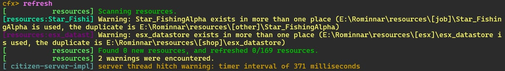
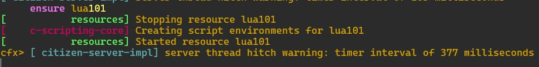
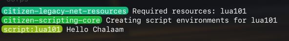

# Lua 101 Print

```
This Lua programing project create for my portfolio 
```

## print("value")

### Client file in client folder

```lua
-- สร้าง function ในการทำงาน
Citizen.CreateThread(function()
    Citizen.Wait(0) -- หน่วงเวลาเพื่อไม่ให้เกมส์ chase
    print("Hello Chalaam") -- กำหนดให้แสดงข้อความที่หน้า console f8 ในเกมส์
end)
```

#### Run file server .bat
#### เข้าสู่เกมส์

#### ดำเนินการ ใช้คำสั่ง refresh



#### ดำเนินการ ใช้คำสั่ง ensure nameFile(ชื่อไฟล์)



#### กด f8 เพื่อตรวจสอบผลลัพธ์


